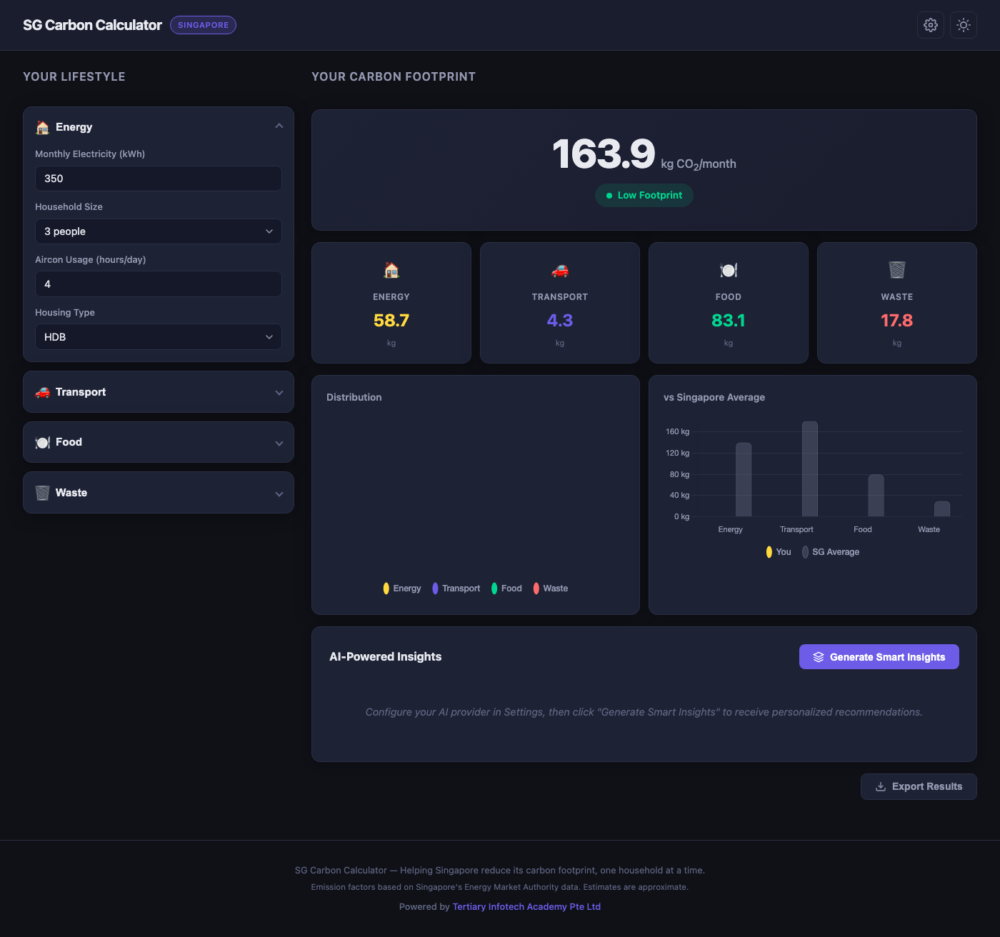

<div align="center">

# SG Carbon Calculator

[](https://developer.mozilla.org/en-US/docs/Web/HTML)
[](https://developer.mozilla.org/en-US/docs/Web/CSS)
[](https://developer.mozilla.org/en-US/docs/Web/JavaScript)
[](https://www.chartjs.org/)
[](https://openai.com/)
[](https://ai.google.dev/)
[](LICENSE)

**A modern, AI-powered carbon footprint calculator built for Singapore residents.**

[Live Demo](https://alfredang.github.io/sgcarboncalculator/) · [Report Bug](https://github.com/alfredang/sgcarboncalculator/issues) · [Request Feature](https://github.com/alfredang/sgcarboncalculator/issues)

</div>

---

## Screenshot



## About

**SG Carbon Calculator** is a browser-based web application that helps Singapore residents estimate, visualize, and reduce their monthly carbon footprint. It uses Singapore-specific emission factors from the Energy Market Authority and provides AI-powered personalized recommendations via OpenAI or Google Gemini.

### Key Features

| Feature | Description |
|---------|-------------|
| **Singapore-Specific** | Uses local emission factors (EMA grid factor ~0.4 kg CO₂/kWh), transport modes (MRT, bus), and housing types (HDB, Condo, Landed) |
| **Real-Time Calculations** | Footprint updates instantly as you adjust inputs — no submit button needed |
| **Interactive Charts** | Doughnut chart for category distribution + bar chart comparing you vs Singapore average |
| **AI-Powered Insights** | Personalized reduction strategies via OpenAI GPT-4o-mini or Google Gemini Flash |
| **Dark/Light Mode** | Sleek dark theme by default with smooth light mode toggle |
| **Export Results** | Copy your carbon report to clipboard or download as text |
| **Privacy-First** | API keys stored in localStorage only — never sent to any third-party server |

## Tech Stack

| Category | Technology |
|----------|------------|
| **Frontend** | HTML5, CSS3, JavaScript (Vanilla) |
| **Charting** | Chart.js 4.x via CDN |
| **AI Providers** | OpenAI GPT-4o-mini, Google Gemini 2.0 Flash |
| **Theming** | CSS Custom Properties (Dark/Light) |
| **Deployment** | GitHub Pages |

## Architecture

```
┌─────────────────────────────────────────────┐
│                  Browser                     │
├─────────────────────────────────────────────┤
│  index.html        │  styles.css            │
│  (Structure)       │  (Dark/Light Theming)  │
├────────────────────┼────────────────────────┤
│  app.js            │  charts.js             │
│  - Emission Engine │  - Pie Chart           │
│  - UI Interactions │  - Bar Chart           │
│  - Theme Toggle    │  - Theme-aware Colors  │
│  - Export          │                        │
├────────────────────┴────────────────────────┤
│  ai.js                                      │
│  - OpenAI API Integration                   │
│  - Gemini API Integration                   │
│  - Prompt Builder & Markdown Renderer       │
├─────────────────────────────────────────────┤
│  localStorage                               │
│  - API Keys  - Theme Preference             │
└─────────────────────────────────────────────┘
```

## Project Structure

```
sgcarboncalculator/
├── index.html          # Main HTML structure & UI layout
├── styles.css          # All styles with dark/light theming
├── app.js              # Carbon calculation engine & UI logic
├── charts.js           # Chart.js visualization setup
├── ai.js               # OpenAI & Gemini AI integration
├── screenshot.png      # App screenshot
└── README.md           # This file
```

## Getting Started

### Prerequisites

- A modern web browser (Chrome, Firefox, Safari, Edge)
- (Optional) An API key from [OpenAI](https://platform.openai.com/api-keys) or [Google AI Studio](https://aistudio.google.com/apikey) for AI insights

### Installation

1. **Clone the repository**
   ```bash
   git clone https://github.com/alfredang/sgcarboncalculator.git
   cd sgcarboncalculator
   ```

2. **Open in browser**
   ```bash
   open index.html
   ```
   Or simply double-click `index.html` — no server required!

3. **(Optional) Configure AI Insights**
   - Click the gear icon in the header
   - Select your AI provider (OpenAI or Gemini)
   - Enter your API key
   - Click "Save Settings"
   - Click "Generate Smart Insights" on the dashboard

## Carbon Categories

| Category | Inputs | Calculation |
|----------|--------|-------------|
| **Energy** | Electricity (kWh), household size, aircon hours, housing type | kWh × 0.4 kg CO₂/kWh + aircon adjustments |
| **Transport** | Mode (MRT/Bus/Car/Ride-hailing), weekly distance | Distance × mode emission factor |
| **Food** | Diet type, meals eaten out per week | Diet multiplier × 30 days + eating-out premium |
| **Waste** | Recycling habit, plastic usage, online shopping | Base waste × recycling × plastic + shopping |

## Deployment

This app is a static site — no build step required. Deploy anywhere that serves HTML:

### GitHub Pages
Already deployed at: [https://alfredang.github.io/sgcarboncalculator/](https://alfredang.github.io/sgcarboncalculator/)

### Any Static Host
Simply upload all files (`index.html`, `styles.css`, `app.js`, `charts.js`, `ai.js`) to your hosting provider.

## Contributing

Contributions are welcome!

1. Fork the repository
2. Create your feature branch (`git checkout -b feature/amazing-feature`)
3. Commit your changes (`git commit -m 'Add amazing feature'`)
4. Push to the branch (`git push origin feature/amazing-feature`)
5. Open a Pull Request

## Developed By

<div align="center">

**[Tertiary Infotech Academy Pte Ltd](https://www.tertiarycourses.com.sg/)**

</div>

## Acknowledgements

- [Energy Market Authority (EMA)](https://www.ema.gov.sg/) — Singapore electricity emission factors
- [Chart.js](https://www.chartjs.org/) — Beautiful chart visualizations
- [OpenAI](https://openai.com/) — GPT-4o-mini for AI insights
- [Google AI](https://ai.google.dev/) — Gemini Flash for AI insights

---

<div align="center">

If you found this useful, please give it a star!

</div>
